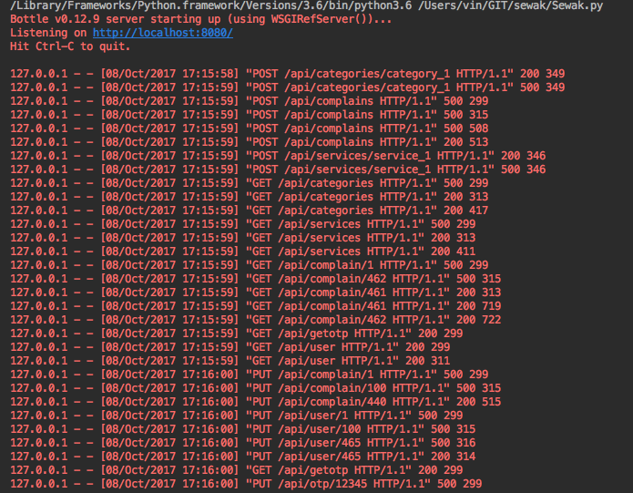
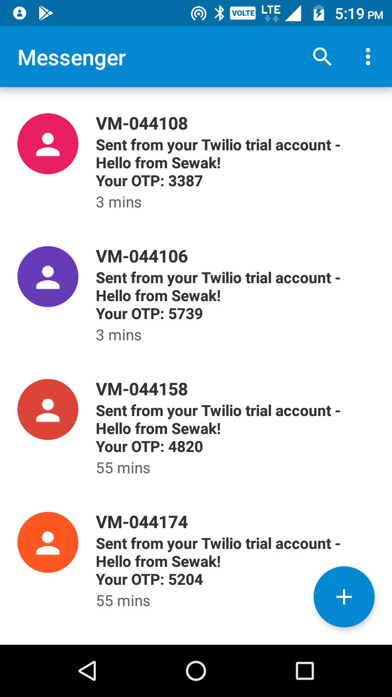
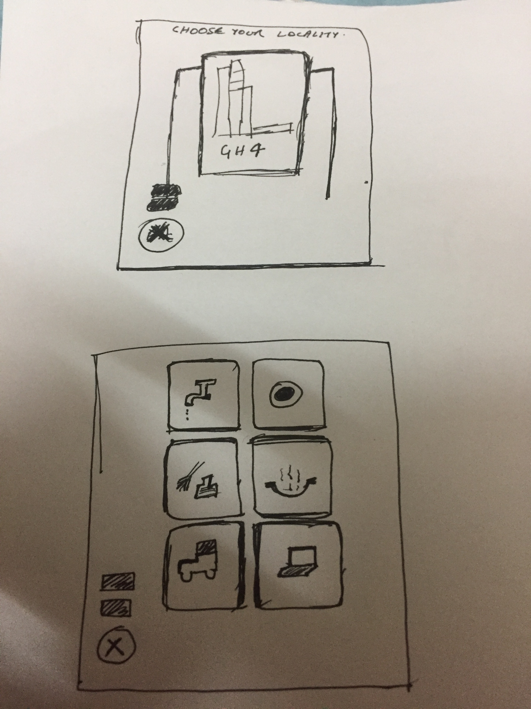

# Sewak - Services at your doorstep! #

Python based server for working with Sewak mobile and web clients.

## Progress Report ##

## Server ##

Whats we are using here :

1. Bottle (https://bottlepy.org/docs/dev/api.html)
2. SqlAlchemy (https://www.sqlalchemy.org/)
3. nose2 (https://github.com/nose-devs/nose2)
4. Requests (http://docs.python-requests.org/en/master/)
5. Heroku (https://www.heroku.com/)

### Sewak Rest Apis ###

### Poc with Twilio ###
https://www.twilio.com/docs/libraries/python

Note: This is the screenshot from the PoC

## Android ##
## TODOs and plan ahead ##

** Use _Kotlin_ for Android dev **

We have to use everything latest.

1. Dagger2 (https://google.github.io/dagger/)
2. Room (https://developer.android.com/topic/libraries/architecture/room.html)
3. Butterknife (https://github.com/JakeWharton/butterknife)
4. MVP Pattern 
5. RxJava (http://www.vogella.com/tutorials/RxJava/article.html)
6. Espresso (https://developer.android.com/training/testing/espresso/index.html)

## Designs here ##

